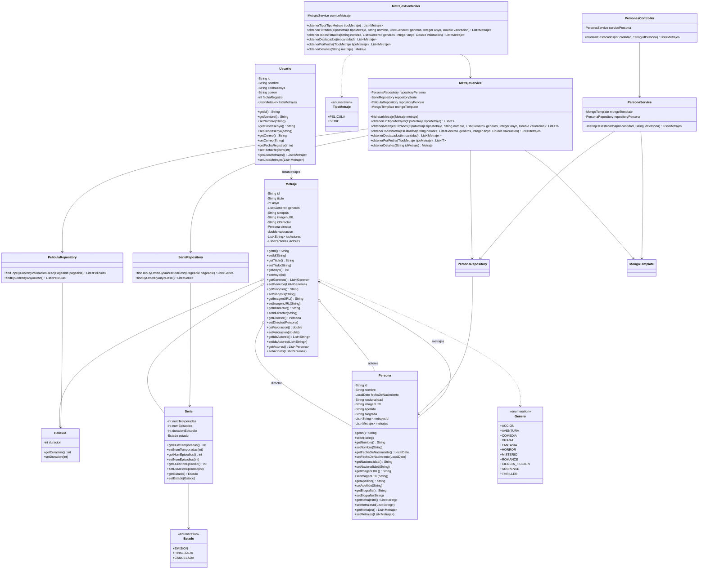

# 🎬 PlotTwist

## 📌 Índice
- [Sobre el proyecto](#sobre-el-proyecto)
- [🛠 Tecnologías Usadas](#-tecnologias-usadas)
- [📋 Requisitos Previos](#-requisitos-previos)
- [🚀 Instalación y Configuración](#-instalacion-y-configuracion)
- [📁 Estructura del Proyecto](#-estructura-del-proyecto)
- [🗂️ Diagrama de Clases](#-diagrama-de-clases)
- [🔗 Endpoints](#-endpoints)
- [🧪 Tests](#-tests)
- [☁️ Despliegue en Cloud (AWS)](#-despliegue-en-cloud-aws)

## Sobre el proyecto

**PlotTwist** es una aplicación web para la gestión y visualización de películas y series. Permite explorar catálogos de contenido audiovisual, aplicar filtros por género, año y valoración, y obtener información detallada sobre actores, directores y metrajes.

## 🛠 Tecnologías Usadas

- **Backend**: Spring Boot 4.0.6
- **Base de Datos**: MongoDB Atlas
- **Lenguaje**: Java 21
- **Framework Web**: Spring Web MVC
- **ORM**: Spring Data MongoDB
- **Frontend**: HTML5, CSS3, JavaScript
- **Testing**: JUnit 5, Spring Boot Test
- **Build Tool**: Maven

## 📋 Requisitos Previos

- **Java**: JDK 21 o superior
- **Maven**: 3.6+ o usar `mvnw`
- **MongoDB**: la conexión está configurada contra MongoDB Atlas en `src/main/java/org/paloma/plottwist/MongoConfig/MongoConfig.java`
- **Navegador Web**: Cualquier navegador moderno

## 🚀 Instalación y Configuración

### 1. Clonar el repositorio
```bash
git clone <url-del-repositorio>
cd plottwist
```

### 2. Configurar e iniciar la aplicación
La aplicación expone la API en el puerto configurado en `src/main/resources/application.properties`:
```properties
spring.application.name=plottwist
server.port=8082
```

La conexión a MongoDB se define en `MongoConfig.java`.

### 3. Ejecutar la aplicación
```bash
# En macOS / Linux
./mvnw spring-boot:run

# En Windows
mvnw.cmd spring-boot:run
```

### 4. Acceder a la aplicación
- **Backend API**: http://localhost:8082
- **Frontend**: abrir `front/index.html` en un servidor web local (por ejemplo, Live Server en VS Code)

## 📁 Estructura del Proyecto

```
plottwist/
├── mvnw & mvnw.cmd          # Maven Wrapper
├── pom.xml                  # Configuración Maven
├── README.md                # Este archivo
├── analisis/                # Documentación de análisis
│   └── casosdeUso.md
├── bd/                      # Datos de ejemplo
│   ├── contraseña_sql.txt
│   ├── peliculas.json
│   ├── personas.json
│   ├── series.json
│   └── usuarios.json
├── diseño/                  # Documentación de diseño
│   ├── diagrama_clase.md
│   └── modelo_no_sql_metrajes.md
├── front/                   # Frontend de la aplicación
│   ├── index.html
│   ├── assets/
│   │   └── img/
│   ├── css/
│   │   ├── detalle-metraje.css
│   │   ├── persona.css
│   │   └── styles.css
│   ├── js/
│   │   ├── detalle.js
│   │   ├── main.js
│   │   ├── metraje.js
│   │   ├── peliculas.js
│   │   ├── personas.js
│   │   └── series.js
│   └── paginas/
│       ├── detalle-metraje.html
│       ├── peliculas.html
│       ├── personas.html
│       └── serie.html
└── src/
    ├── main/
    │   ├── java/org/paloma/plottwist/
    │   │   ├── PlottwistApplication.java    # Clase principal
    │   │   ├── WebConfig.java               # Configuración MVC / CORS
    │   │   ├── controller/                  # Controladores REST
    │   │   │   ├── MetrajesController.java
    │   │   │   └── PersonasController.java
    │   │   ├── model/                       # Modelos de datos
    │   │   │   ├── Estado.java
    │   │   │   ├── Genero.java
    │   │   │   ├── Metraje.java
    │   │   │   ├── Pelicula.java
    │   │   │   ├── Persona.java
    │   │   │   ├── Serie.java
    │   │   │   ├── TipoMetraje.java
    │   │   │   └── Usuario.java
    │   │   ├── MongoConfig/                 # Configuración MongoDB
    │   │   │   └── MongoConfig.java
    │   │   ├── repository/                  # Repositorios de datos
    │   │   │   ├── PeliculaRepository.java
    │   │   │   ├── PersonaRepository.java
    │   │   │   └── SerieRepository.java
    │   │   └── service/                     # Lógica de negocio
    │   │       ├── MetrajeService.java
    │   │       └── PersonaService.java
    │   └── resources/
    │       └── application.properties       # Configuración de la app
    └── test/
        └── java/org/paloma/plottwist/       # Tests
            ├── MetrajeServiceIntegrationTest.java
            ├── PeliculaRepositoryIntegrationTest.java
            └── PlottwistApplicationTests.java
```

## 🗂️ Diagrama de Clases



## 🔗 Endpoints

### Metrajes Controller (`/metrajes`)

#### `GET /obtenerTipo`
Obtiene todos los metrajes de un tipo específico (películas o series).

**Parámetros:**
- `tipoMetraje` (obligatorio): Tipo de metraje a obtener. Valores: `PELICULA` o `SERIE`

**Ejemplo:**
```
GET http://localhost:8082/metrajes/obtenerTipo?tipoMetraje=PELICULA
```

#### `GET /obtenerFiltrados`
Obtiene metrajes de un tipo específico aplicando filtros opcionales de búsqueda.

**Parámetros:**
- `tipoMetraje` (obligatorio): Tipo de metraje a obtener. Valores: `PELICULA` o `SERIE`
- `nombre` (opcional): Texto a buscar en el título del metraje
- `generos` (opcional): Lista de géneros separados por coma. Valores: `ACCION`, `DRAMA`, `COMEDIA`, `FANTASIA`, `HORROR`, `MISTERIO`, `ROMANCE`, `CIENCIA_FICCION`, `SUSPENSE`, `THRILLER`
- `anyo` (opcional): Año de estreno del metraje
- `valoracion` (opcional): Valoración numérica (1-5). Retorna metrajes con valoración entre x.0 y x.9

**Ejemplo:**
```
GET http://localhost:8082/metrajes/obtenerFiltrados?tipoMetraje=PELICULA&generos=ACCION,DRAMA&anyo=2020&valoracion=4
```

#### `GET /obtenerTodosFiltrados`
Obtiene películas y series combinadas aplicando los mismos filtros de búsqueda.

**Parámetros:**
- `nombre` (opcional): Texto a buscar en el título del metraje
- `generos` (opcional): Lista de géneros separados por coma
- `anyo` (opcional): Año de estreno del metraje
- `valoracion` (opcional): Valoración numérica (1-5)

**Ejemplo:**
```
GET http://localhost:8082/metrajes/obtenerTodosFiltrados?nombre=batman&generos=ACCION&valoracion=4
```

#### `GET /obtenerDestacados`
Obtiene los metrajes más destacados (mejor valorados) de cada tipo.

**Parámetros:**
- `cantidad` (obligatorio): Número de películas y de series a retornar (total = cantidad × 2)

**Ejemplo:**
```
GET http://localhost:8082/metrajes/obtenerDestacados?cantidad=5
```

#### `GET /obtenerPorFecha`
Obtiene los metrajes ordenados por año de estreno de más reciente a más antiguo.

**Parámetros:**
- `tipoMetraje` (obligatorio): Tipo de metraje a ordenar. Valores: `PELICULA` o `SERIE`

**Ejemplo:**
```
GET http://localhost:8082/metrajes/obtenerPorFecha?tipoMetraje=SERIE
```

#### `GET /obtenerDetalles`
Obtiene los detalles completos de un metraje específico, incluyendo información del director y actores.

**Parámetros:**
- `metraje` (obligatorio): ID del metraje a obtener

**Ejemplo:**
```
GET http://localhost:8082/metrajes/obtenerDetalles?metraje=507f1f77bcf86cd799439011
```

### Personas Controller (`/personas`)

#### `GET /mostrarDestacados`
Obtiene los metrajes más destacados de una persona específica (actor o director).

**Parámetros:**
- `cantidad` (obligatorio): Número de películas y de series a retornar de la persona
- `idPersona` (obligatorio): ID de la persona (actor o director) de la que se desean obtener los metrajes

**Ejemplo:**
```
GET http://localhost:8082/personas/mostrarDestacados?cantidad=3&idPersona=507f1f77bcf86cd799439012
```

## 🧪 Tests

El proyecto incluye tests unitarios e de integración:

### Tests Disponibles
- **PlottwistApplicationTests**: Test básico de carga del contexto de Spring
- **MetrajeServiceIntegrationTest**: Tests de integración para el servicio de metrajes
- **PeliculaRepositoryIntegrationTest**: Tests de repositorio para películas

### Ejecutar Tests
```bash
# Ejecutar todos los tests
./mvnw test

# Ejecutar tests específicos
./mvnw test -Dtest=MetrajeServiceIntegrationTest
```

### Cobertura de Tests
Los tests cubren:
- ✅ Lógica de negocio de servicios
- ✅ Consultas a base de datos
- ✅ Hidratación de objetos relacionados
- ✅ Filtros y búsquedas
- ✅ Ordenamiento por valoración


## ☁️ Despliegue en Cloud (AWS)

La aplicación está desplegada en **Amazon Web Services** usando dos instancias EC2 independientes,
cada una con IP elástica (estática) asignada.

### Infraestructura

| Instancia | SO | Software | Puerto |
|---|---|---|---|
| EC2 Web | Ubuntu Server | Apache2 | 80 |
| EC2 API | Ubuntu Server | Java JRE + Spring Boot | 8082 |

- **EC2 Web**: sirve el frontend estático (HTML, CSS, JS) mediante Apache2.
- **EC2 API**: ejecuta el backend Spring Boot, expone la API REST en el puerto 8082.
- **MongoDB Atlas**: base de datos en la nube, accesible desde la EC2 API.

### CI/CD

El repositorio incluye dos workflows de GitHub Actions:

- `front.yml` — despliega automáticamente el frontend en la EC2 Web.
- `back.yml` — compila y despliega el backend en la EC2 API.

### Acceso

Una vez desplegado:
- **Frontend**: `http://<IP-EC2-WEB>`
- **API**: `http://<IP-EC2-API>:8082`

---

**Desarrollado por**: MiguelSg77, JesusCanas y AdrianStephano  
**Versión**: 1.0