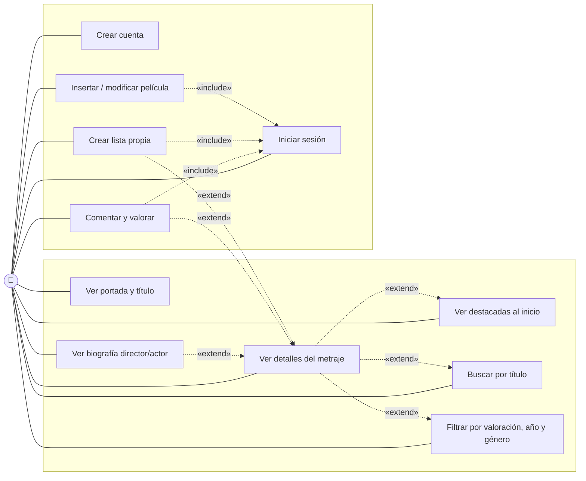

```mermaid
flowchart LR
  actor((🧍))

  %% Asociaciones
  actor --- Inicio
  actor --- BuscarNombre
  actor --- DatosPortada
  actor --- VerInfo
  actor --- FiltrarEtiquetas
  actor --- VerBiografía
  actor --- CrearCuenta
  actor --- Sesion
  actor --- InsertarDatos
  actor --- CrearLista
  actor --- Comentarios

  %% INCLUDE
  Comentarios -.->|«include»| Sesion
  CrearLista -.->|«include»| Sesion
  InsertarDatos -.->|«include»| Sesion

  %% EXTEND
  VerInfo -.->|«extend»| Inicio
  VerInfo -.->|«extend»| BuscarNombre
  VerInfo -.->|«extend»| FiltrarEtiquetas
  VerBiografía -.->|«extend»| VerInfo
  Comentarios -.->|«extend»| VerInfo
  CrearLista -.->|«extend»| VerInfo

  %% Nombres sin números
  Inicio["Ver destacadas al inicio"]
  BuscarNombre["Buscar por título"]
  DatosPortada["Ver portada y título"]
  VerInfo["Ver detalles del metraje"]
  FiltrarEtiquetas["Filtrar por valoración, año y género"]
  VerBiografía["Ver biografía director/actor"]
  CrearCuenta["Crear cuenta"]
  InsertarDatos["Insertar / modificar película"]
  CrearLista["Crear lista propia"]
  Sesion["Iniciar sesión"]
  Comentarios["Comentar y valorar"]

  %% Agrupaciones para ordenar verticalmente
  subgraph " "
    direction TB
    Inicio
    BuscarNombre
    DatosPortada
    VerInfo
    FiltrarEtiquetas
    VerBiografía
  end

  subgraph "  "
    direction TB
    CrearCuenta
    Sesion
    InsertarDatos
    CrearLista
    Comentarios
  end
```