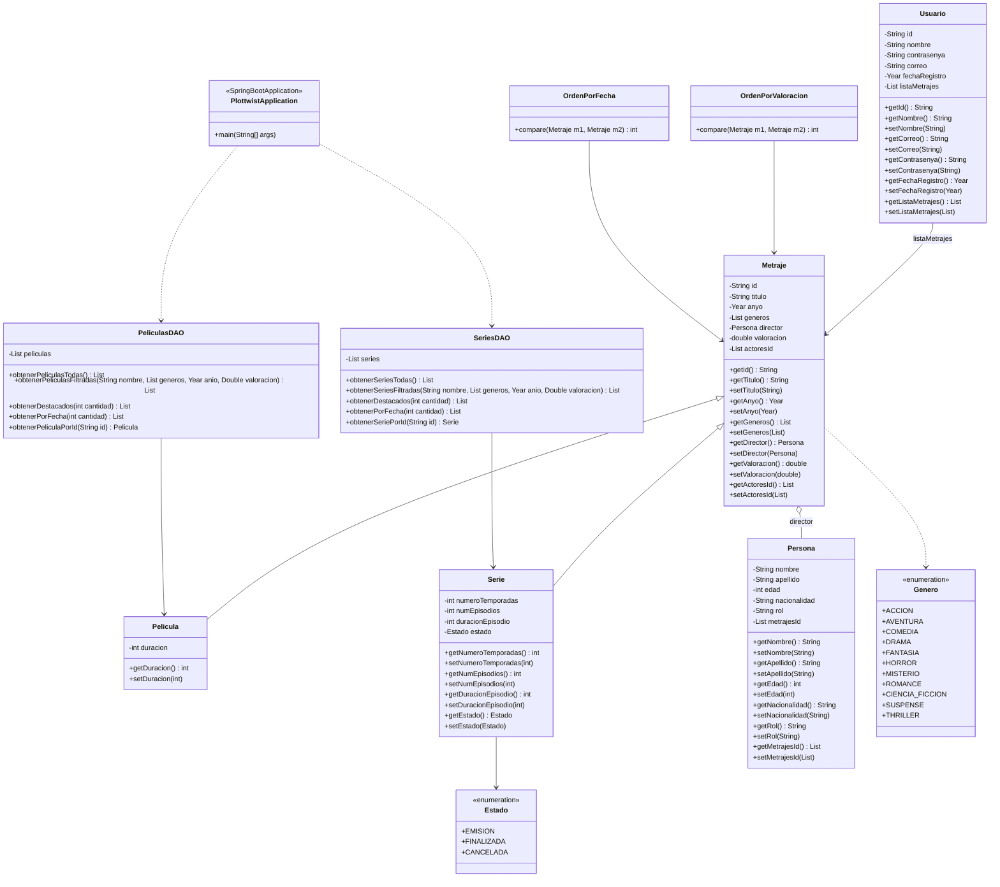

# Ver los peliculas y series

```mermaid
classDiagram
    class Metraje {
        -String id
        -String titulo
        -Year anyo
        -List<Genero> generos
        -Persona director
        -double valoracion
        -List<String> actoresId
        +getId() String
        +getTitulo() String
        +setTitulo(String)
        +getAnyo() Year
        +setAnyo(Year)
        +getGeneros() List<Genero>
        +setGeneros(List<Genero>)
        +getDirector() Persona
        +setDirector(Persona)
        +getValoracion() double
        +setValoracion(double)
        +getActoresId() List<String>
        +setActoresId(List<String>)
    }

    class Pelicula {
        -int duracion
        +getDuracion() int
        +setDuracion(int)
    }

    class Serie {
        -int numeroTemporadas
        -int numEpisodios
        -int duracionEpisodio
        -Estado estado
        +getNumeroTemporadas() int
        +setNumeroTemporadas(int)
        +getNumEpisodios() int
        +setNumEpisodios(int)
        +getDuracionEpisodio() int
        +setDuracionEpisodio(int)
        +getEstado() Estado
        +setEstado(Estado)
    }
    class Persona {
        -String nombre
        -String apellido
        -int edad
        -String nacionalidad
        -String rol
        -List<String> metrajesId
        +getNombre() String
        +setNombre(String)
        +getApellido() String
        +setApellido(String)
        +getEdad() int
        +setEdad(int)
        +getNacionalidad() String
        +setNacionalidad(String)
        +getRol() String
        +setRol(String)
        +getMetrajesId() List<String>
        +setMetrajesId(List<String>)
    }

    class PeliculasDAO {
        -List<Pelicula> peliculas
        +obtenerPeliculasTodas() List<Pelicula>
        +obtenerPeliculasFiltradas(String nombre, List<Genero> generos, Year anio, Double valoracion) List<Pelicula>
        +obtenerDestacados(int cantidad) List<Pelicula>
        +obtenerPorFecha(int cantidad) List<Pelicula>
        +obtenerPeliculaPorId(String id) Pelicula
    }

    class SeriesDAO {
        -List<Serie> series
        +obtenerSeriesTodas() List<Serie>
        +obtenerSeriesFiltradas(String nombre, List<Genero> generos, Year anio, Double valoracion) List<Serie>
        +obtenerDestacados(int cantidad) List<Serie>
        +obtenerPorFecha(int cantidad) List<Serie>
        +obtenerSeriePorId(String id) Serie
    }

    class PlottwistApplication {
        <<SpringBootApplication>>
        +main(String[] args)
    }

    class Usuario {
        -String id
        -String nombre
        -String contrasenya
        -String correo
        -Year fechaRegistro
        -List<Metraje> listaMetrajes
        +getId() String
        +getNombre() String
        +setNombre(String)
        +getCorreo() String
        +setCorreo(String)
        +getContrasenya() String
        +setContrasenya(String)
        +getFechaRegistro() Year
        +setFechaRegistro(Year)
        +getListaMetrajes() List<Metraje>
        +setListaMetrajes(List<Metraje>)
    }

    Metraje <|-- Pelicula
    Metraje <|-- Serie
    Metraje o-- Persona : director
    Usuario --> Metraje : listaMetrajes
    PeliculasDAO --> Pelicula
    SeriesDAO --> Serie
    OrdenPorValoracion --> Metraje
    OrdenPorFecha --> Metraje
    Serie --> Estado
    Metraje ..> Genero
    PlottwistApplication ..> PeliculasDAO
    PlottwistApplication ..> SeriesDAO

    class OrdenPorValoracion {
        +compare(Metraje m1, Metraje m2) int
    }

    class OrdenPorFecha {
        +compare(Metraje m1, Metraje m2) int
    }

    class Genero {
        <<enumeration>>
        +ACCION
        +AVENTURA
        +COMEDIA
        +DRAMA
        +FANTASIA
        +HORROR
        +MISTERIO
        +ROMANCE
        +CIENCIA_FICCION
        +SUSPENSE
        +THRILLER
    }

    class Estado {
        <<enumeration>>
        +EMISION
        +FINALIZADA
        +CANCELADA
    }

```

