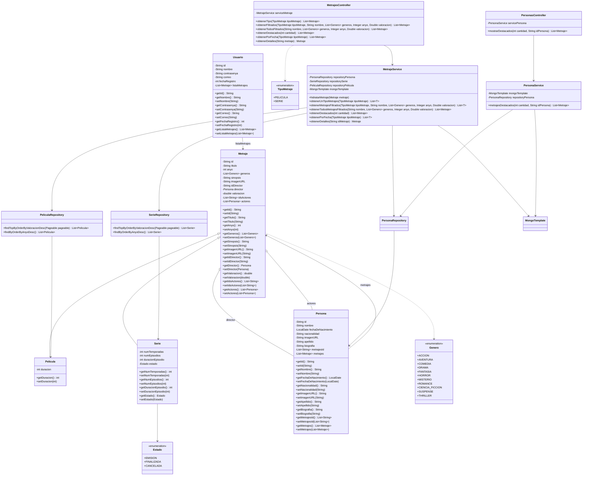

```mermaid
classDiagram
    class Metraje {
        -String id
        -String titulo
        -int anyo
        -List~Genero~ generos
        -String sinopsis
        -String imagenURL
        -String idDirector
        -Persona director
        -double valoracion
        -List~String~ idsActores
        -List~Persona~ actores
        +getId() String
        +setId(String)
        +getTitulo() String
        +setTitulo(String)
        +getAnyo() int
        +setAnyo(int)
        +getGeneros() List~Genero~
        +setGeneros(List~Genero~)
        +getSinopsis() String
        +setSinopsis(String)
        +getImagenURL() String
        +setImagenURL(String)
        +getIdDirector() String
        +setIdDirector(String)
        +getDirector() Persona
        +setDirector(Persona)
        +getValoracion() double
        +setValoracion(double)
        +getIdsActores() List~String~
        +setIdsActores(List~String~)
        +getActores() List~Persona~
        +setActores(List~Persona~)
    }

    class Pelicula {
        -int duracion
        +getDuracion() int
        +setDuracion(int)
    }

    class Serie {
        -int numTemporadas
        -int numEpisodios
        -int duracionEpisodio
        -Estado estado
        +getNumTemporadas() int
        +setNumTemporadas(int)
        +getNumEpisodios() int
        +setNumEpisodios(int)
        +getDuracionEpisodio() int
        +setDuracionEpisodio(int)
        +getEstado() Estado
        +setEstado(Estado)
    }

    class Persona {
        -String id
        -String nombre
        -LocalDate fechaDeNacimiento
        -String nacionalidad
        -String imagenURL
        -String apellido
        -String biografia
        -List~String~ metrajesId
        -List~Metraje~ metrajes
        +getId() String
        +setId(String)
        +getNombre() String
        +setNombre(String)
        +getFechaDeNacimiento() LocalDate
        +setFechaDeNacimiento(LocalDate)
        +getNacionalidad() String
        +setNacionalidad(String)
        +getImagenURL() String
        +setImagenURL(String)
        +getApellido() String
        +setApellido(String)
        +getBiografia() String
        +setBiografia(String)
        +getMetrajesId() List~String~
        +setMetrajesId(List~String~)
        +getMetrajes() List~Metraje~
        +setMetrajes(List~Metraje~)
    }

    class Usuario {
        -String id
        -String nombre
        -String contrasenya
        -String correo
        -int fechaRegistro
        -List~Metraje~ listaMetrajes
        +getId() String
        +getNombre() String
        +setNombre(String)
        +getContrasenya() String
        +setContrasenya(String)
        +getCorreo() String
        +setCorreo(String)
        +getFechaRegistro() int
        +setFechaRegistro(int)
        +getListaMetrajes() List~Metraje~
        +setListaMetrajes(List~Metraje~)
    }

    class Genero {
        <<enumeration>>
        +ACCION
        +AVENTURA
        +COMEDIA
        +DRAMA
        +FANTASIA
        +HORROR
        +MISTERIO
        +ROMANCE
        +CIENCIA_FICCION
        +SUSPENSE
        +THRILLER
    }

    class Estado {
        <<enumeration>>
        +EMISION
        +FINALIZADA
        +CANCELADA
    }

    class TipoMetraje {
        <<enumeration>>
        +PELICULA
        +SERIE
    }

    class PeliculaRepository {
        +findTopByOrderByValoracionDesc(Pageable pageable) List~Pelicula~
        +findByOrderByAnyoDesc() List~Pelicula~
    }

    class SerieRepository {
        +findTopByOrderByValoracionDesc(Pageable pageable) List~Serie~
        +findByOrderByAnyoDesc() List~Serie~
    }

    class PersonaRepository {
    }

    class MetrajeService {
        -PersonaRepository repositoryPersona
        -SerieRepository repositorySerie
        -PeliculaRepository repositoryPelicula
        -MongoTemplate mongoTemplate
        +hidratarMetraje(Metraje metraje)
        +obtenerUnTipoMetrajes(TipoMetraje tipoMetraje) List~T~
        +obtenerMetrajesFiltrados(TipoMetraje tipoMetraje, String nombre, List~Genero~ generos, Integer anyo, Double valoracion) List~T~
        +obtenerTodosMetrajesFiltrados(String nombre, List~Genero~ generos, Integer anyo, Double valoracion) List~Metraje~
        +obtenerDestacados(int cantidad) List~Metraje~
        +obtenerPorFecha(TipoMetraje tipoMetraje) List~T~
        +obtenerDetalles(String idMetraje) Metraje
    }

    class PersonaService {
        -MongoTemplate mongoTemplate
        -PersonaRepository repositoryPersona
        +metrajesDestacados(int cantidad, String idPersona) List~Metraje~
    }

    class MetrajesController {
        -MetrajeService serviceMetraje
        +obtenerTipo(TipoMetraje tipoMetraje) List~Metraje~
        +obtenerFiltrados(TipoMetraje tipoMetraje, String nombre, List~Genero~ generos, Integer anyo, Double valoracion) List~Metraje~
        +obtenerTodosFiltrados(String nombre, List~Genero~ generos, Integer anyo, Double valoracion) List~Metraje~
        +obtenerDestacados(int cantidad) List~Metraje~
        +obtenerPorFecha(TipoMetraje tipoMetraje) List~Metraje~
        +obtenerDetalles(String metraje) Metraje
    }

    class PersonasController {
        -PersonaService servicePersona
        +mostrarDestacados(int cantidad, String idPersona) List~Metraje~
    }

    Metraje <|-- Pelicula
    Metraje <|-- Serie
    Metraje o-- Persona : director
    Metraje o-- Persona : actores
    Persona --> Metraje : metrajes
    Usuario --> Metraje : listaMetrajes
    Serie --> Estado
    Metraje ..> Genero
    MetrajeService --> PersonaRepository
    MetrajeService --> SerieRepository
    MetrajeService --> PeliculaRepository
    MetrajeService --> MongoTemplate
    PersonaService --> PersonaRepository
    PersonaService --> MongoTemplate
    MetrajesController --> MetrajeService
    MetrajesController ..> TipoMetraje
    PersonasController --> PersonaService
    PeliculaRepository --> Pelicula
    SerieRepository --> Serie
    PersonaRepository --> Persona
```