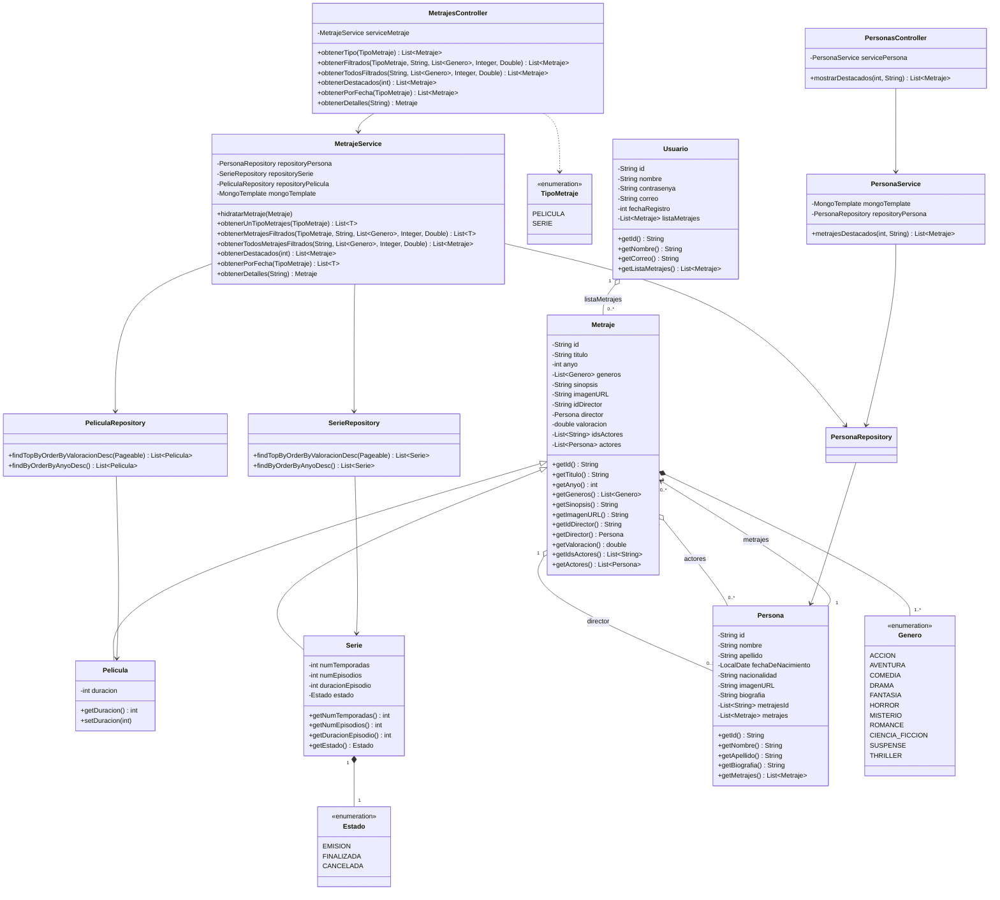

```mermaid
classDiagram
    class Metraje {
        -String id
        -String titulo
        -int anyo
        -List~Genero~ generos
        -String sinopsis
        -String imagenURL
        -String idDirector
        -Persona director
        -double valoracion
        -List~String~ idsActores
        -List~Persona~ actores
        +getId() String
        +getTitulo() String
        +getAnyo() int
        +getGeneros() List~Genero~
        +getSinopsis() String
        +getImagenURL() String
        +getIdDirector() String
        +getDirector() Persona
        +getValoracion() double
        +getIdsActores() List~String~
        +getActores() List~Persona~
    }

    class Pelicula {
        -int duracion
        +getDuracion() int
        +setDuracion(int)
    }

    class Serie {
        -int numTemporadas
        -int numEpisodios
        -int duracionEpisodio
        -Estado estado
        +getNumTemporadas() int
        +getNumEpisodios() int
        +getDuracionEpisodio() int
        +getEstado() Estado
    }

    class Persona {
        -String id
        -String nombre
        -String apellido
        -LocalDate fechaDeNacimiento
        -String nacionalidad
        -String imagenURL
        -String biografia
        -List~String~ metrajesId
        -List~Metraje~ metrajes
        +getId() String
        +getNombre() String
        +getApellido() String
        +getBiografia() String
        +getMetrajes() List~Metraje~
    }

    class Usuario {
        -String id
        -String nombre
        -String contrasenya
        -String correo
        -int fechaRegistro
        -List~Metraje~ listaMetrajes
        +getId() String
        +getNombre() String
        +getCorreo() String
        +getListaMetrajes() List~Metraje~
    }

    class Genero {
        <<enumeration>>
        ACCION
        AVENTURA
        COMEDIA
        DRAMA
        FANTASIA
        HORROR
        MISTERIO
        ROMANCE
        CIENCIA_FICCION
        SUSPENSE
        THRILLER
    }

    class Estado {
        <<enumeration>>
        EMISION
        FINALIZADA
        CANCELADA
    }

    class TipoMetraje {
        <<enumeration>>
        PELICULA
        SERIE
    }

    class PeliculaRepository {
        +findTopByOrderByValoracionDesc(Pageable) List~Pelicula~
        +findByOrderByAnyoDesc() List~Pelicula~
    }

    class SerieRepository {
        +findTopByOrderByValoracionDesc(Pageable) List~Serie~
        +findByOrderByAnyoDesc() List~Serie~
    }

    class PersonaRepository {
    }

    class MetrajeService {
        -PersonaRepository repositoryPersona
        -SerieRepository repositorySerie
        -PeliculaRepository repositoryPelicula
        -MongoTemplate mongoTemplate
        +hidratarMetraje(Metraje)
        +obtenerUnTipoMetrajes(TipoMetraje) List~T~
        +obtenerMetrajesFiltrados(TipoMetraje, String, List~Genero~, Integer, Double) List~T~
        +obtenerTodosMetrajesFiltrados(String, List~Genero~, Integer, Double) List~Metraje~
        +obtenerDestacados(int) List~Metraje~
        +obtenerPorFecha(TipoMetraje) List~T~
        +obtenerDetalles(String) Metraje
    }

    class PersonaService {
        -MongoTemplate mongoTemplate
        -PersonaRepository repositoryPersona
        +metrajesDestacados(int, String) List~Metraje~
    }

    class MetrajesController {
        -MetrajeService serviceMetraje
        +obtenerTipo(TipoMetraje) List~Metraje~
        +obtenerFiltrados(TipoMetraje, String, List~Genero~, Integer, Double) List~Metraje~
        +obtenerTodosFiltrados(String, List~Genero~, Integer, Double) List~Metraje~
        +obtenerDestacados(int) List~Metraje~
        +obtenerPorFecha(TipoMetraje) List~Metraje~
        +obtenerDetalles(String) Metraje
    }

    class PersonasController {
        -PersonaService servicePersona
        +mostrarDestacados(int, String) List~Metraje~
    }

    %% Herencia
    Metraje <|-- Pelicula
    Metraje <|-- Serie

    %% Composición (no existe sin el padre)
    Metraje "1" *-- "1..*" Genero
    Serie "1" *-- "1" Estado

    %% Agregación con dos relaciones para Persona
    Metraje "1" o-- "0..1" Persona : director
    Metraje "1" o-- "0..*" Persona : actores

    %% Agregación Usuario -> Metraje
    Usuario "1" o-- "0..*" Metraje : listaMetrajes

    %% Asociación Persona -> Metraje
    Persona "1" --> "0..*" Metraje : metrajes

    %% Repositorios -> modelos (asociación simple)
    PeliculaRepository --> Pelicula
    SerieRepository --> Serie
    PersonaRepository --> Persona

    %% Services -> Repositories (asociación simple)
    MetrajeService --> PeliculaRepository
    MetrajeService --> SerieRepository
    MetrajeService --> PersonaRepository
    PersonaService --> PersonaRepository

    %% Controllers -> Services (asociación simple)
    MetrajesController --> MetrajeService
    PersonasController --> PersonaService

    %% Dependencia puntual
    MetrajesController ..> TipoMetraje
```